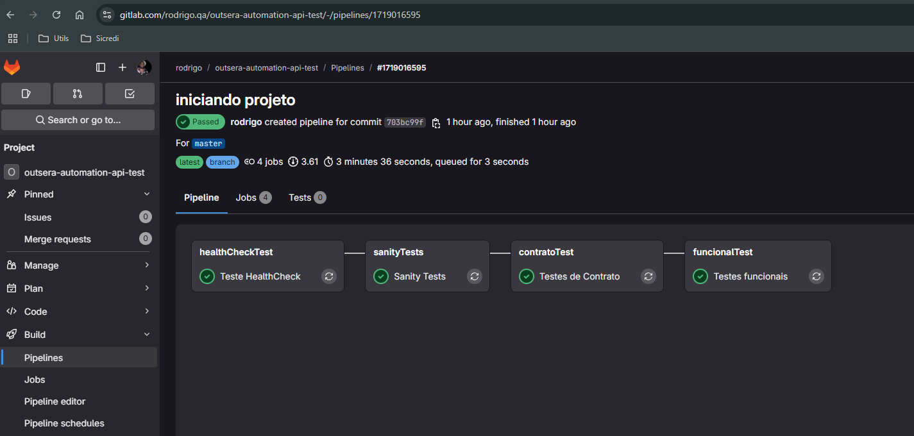
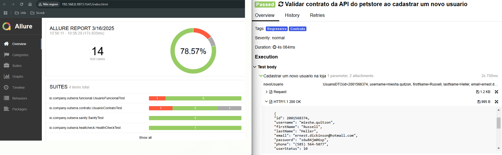

# Prova Técnica - Automação de Testes API

## Sobre o projeto

Este projeto foi desenvolvido para demonstrar uma cobertura de testes abrangendo diversas camadas, incluindo:
- **HealthCheck**
- **Sanity**
- **Contrato**
- **Funcional**

Ele permite a execução dos testes localmente, evitando concorrência ao utilizar a API pública. Para isso, basta iniciar a imagem da API através do `docker-compose.yml` e configurar o ambiente para `env=local`.

Por padrão, o projeto já vem configurado para utilizar a API pública com `env=hom`.

---
## Documentação da API

Swagger: [Petstore Swagger](https://petstore.swagger.io/)

Repositório: [GitLab - Rodrigo QA](https://gitlab.com/rodrigo.qa/outsera-automation-api-test)

---
## Estrutura do projeto

### Diretórios principais

#### **Main**
- **client**: Contém as classes responsáveis por realizar as requisições para o back-end.
- **dto**: Inclui o mapeamento dos atributos e a construção dos objetos específicos para cada API.
- **factory**: Contém classes ou objetos utilizados para retornar dados fictícios ou similares aos dados de produção.
- **utils**: Contém classes auxiliares para a construção dos testes, enumerações e configurações de ambiente.

#### **Test**
- **sanity**: Valida os cenários mais críticos da aplicação.
- **contrato**: Agrupa os testes que validam o contrato das requisições.
- **funcional**: Contém os testes funcionais do projeto.
- **healthCheck**: Verifica se o serviço está disponível.

---
## Requisitos

Para executar o projeto, é necessário ter instalado:
- **Java 17** ou superior
- **Maven** 
- **Lombok** Instalar o plugin Lombok e habilita-lo na IDE
- **Docker** (Opcional, caso deseje rodar os testes localmente)

---

## Tecnologias e Bibliotecas
- Java 17
- Maven
- [RestAssured](https://rest-assured.io/docs)
- [Junit 5](https://junit.org/junit5/docs/current/user-guide/)
- [Json Schema Validator](https://github.com/rest-assured/rest-assured/wiki/Usage#json-schema-validation)
- [Lombok](https://projectlombok.org/)
- [JavaFaker](https://www.baeldung.com/java-faker)

---

## Como executar os testes

### Instalação das dependências

Antes de executar os testes, baixe as dependências do projeto com o comando:
```sh
mvn install
```

### Execução local

Se optar por rodar os testes localmente, será necessário iniciar a API via Docker:
```sh
docker-compose up -d
```
> **Nota**: Essa opção requer o Docker instalado na máquina.

### Execução dos testes

Para rodar os testes, utilize:
```sh
mvn test clean -Dgroups=Regressivo -Denv=local -e
```
Parâmetros:
- `-Dgroups`: Tag referente ao teste (Opcional)
- `-Denv`: Ambiente a ser utilizado (Default = `hom`)

---
## Tags disponíveis

- **HealthCheck**
- **Sanity**
- **Contrato**
- **Funcional**

---
## Integração Contínua (CI/CD)

Foi implementada uma solução para rodar os testes utilizando o **CI do GitLab**. Os testes são executados em estágios, garantindo que avançamos para as próximas fases apenas em caso de sucesso.



---

## Relatórios de Testes

Após a execução, é possível gerar relatórios utilizando a biblioteca **Allure**. Esses relatórios permitem visualizar os resultados dos testes, bem como os logs das requisições e respostas de forma simplificada.

Para gerar o relatório, execute:
```sh
mvn allure:serve
```

