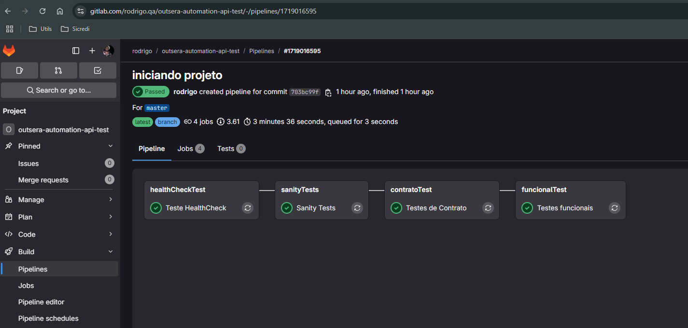
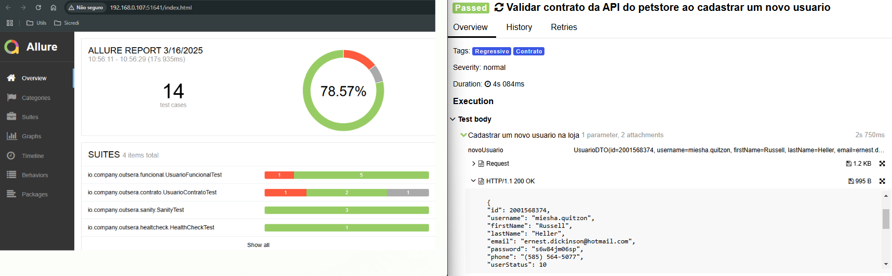

# PROVA TECNICA AUTOMAÇÃO DE TESTES API

## Automação de testes

Este projeto foi elaborado pensando em exemplificar uma cobertura de testes em diversas camadas, Podemos utilizar dois tipos de ambiente para rodar os testes 'local'  
onde podemos startar uma imagem da API e assim evitar correncia da API publica ou 'hom' utilizando a API publica diponivel no link abaixo.. 
https://petstore.swagger.io/

-HealtCheck 
-Sanity 
-Contrato 
-Funcional 

### Pré-condições

Para execução do projeto, é necessário possuir as seguintes instalações na máquina:
- Java 17 ou superior;
- Maven.
- Docker (Opcional)

### Executando o projeto
Após atender as pré-condições, executar o comando `mvn install` para baixar as dependências;

Caso opter roda local: `docker-compose up -d`. obs:(requerido docker) 
Para executar os testes, executar o comando: `mvn test clean -Dgroups=Regressivo -Denv=local -e`. 
-Dgroups: Tag referente ao teste(Opcional)  
-Denv: Ambiente(Default=hom) 

### Tags
- Healthcheck
- Sanity
- Contrato
- Funcional

### Estrutura dos testes

#### Main
- **client:** contém as classes que irão realizar as requisições para o back-end;
- **dto:** inclui o mapeamento dos atributos e contrução dos objetos específicos para cada API;
- **factory:** classe ou objetos utilizados para retornar dados fictícios ou similares aos dados de produção.
- **utils:** contém classes auxiliares na construção dos testes, enumerações e configurações de ambiente.

#### Test
- **Sanity:** verifcar os cenarios mais criticos da aplicação;
- **Contrato:** agrupam os testes que validam o contrato das requisições;
- **functional:** agrupam os testes funcionais do projeto;
- **healthCheck:** verificam se o serviço está disponível;

### CI/CD

#### gitlab.ci
Foi implementado uma soluçâo para rodar os testes utilizado o CI do gitlab.ci. 
Os testes seram executados em estágios onde apenas vamos avançar para os proximos em caso de sucesso.

#### Relatórios
Após a execução dos testes é possível gerar o relatório com ajuda da biblioteca do Allure, desta forma é possivel visualizar todos resultados dos testes assim como os ‘logs’ das requests/response de forma mais simplificada. 
Para visualizar o relatório, basta executar o comando: `mvn allure:serve` 
